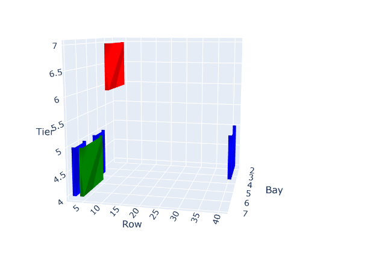

# BAPLIE 3D Visualizer

A Python application that uses Google's Gemini 2.0 AI to process BAPLIE (EDI) messages and generate interactive 3D visualizations of container ship loading plans.

## Screenshots

### Main Interface


### Container Visualization


## Features

- Parse BAPLIE EDI messages using direct parsing and AI-powered backup
- Interactive 3D visualization of container positions
- Color-coded container types (GP, RE, OT)
- Support for 20ft, 40ft, and 45ft containers
- Real-time error feedback
- Web-based interface using Dash and Plotly

## Prerequisites

- Python 3.9+
- Google Gemini API key (get one from [Google AI Studio](https://makersuite.google.com/app/apikey))

## Installation

1. Clone the repository:
```bash
git clone https://github.com/nezpik/Pistology-3DBaplie.git
cd Pistology-3DBaplie
```

2. Install the required dependencies:
```bash
pip install -r requirements.txt
```

3. Set up your environment variables:
   - Copy `env.example` to `.env`
   - Replace `your_api_key_here` with your actual Gemini API key

## Usage

1. Run the application:
```bash
python app.py
```

2. Open your web browser and navigate to `http://localhost:8050`

3. Paste your BAPLIE message into the text area

4. Click "Generate 3D View" to see the visualization

## BAPLIE Message Format

The application supports standard BAPLIE EDI messages. A sample message is provided in `sample_baplie.txt`. The message should contain:

- Container information in EQD segments
- Location information in LOC segments
- Container types (GP, RE, OT)
- Container sizes (20ft, 40ft, 45ft)

## Security Note

- Never commit your `.env` file containing your API key
- The `.env` file is included in `.gitignore` to prevent accidental commits
- Use `env.example` as a template to create your own `.env` file

## Contributing

1. Fork the repository
2. Create your feature branch (`git checkout -b feature/amazing-feature`)
3. Commit your changes (`git commit -m 'Add some amazing feature'`)
4. Push to the branch (`git push origin feature/amazing-feature`)
5. Open a Pull Request

## License

This project is licensed under the MIT License - see the [LICENSE](LICENSE) file for details.

## Acknowledgments

- Google Gemini AI for BAPLIE message processing
- Plotly and Dash for 3D visualization
- SMDG for BAPLIE message format documentation
